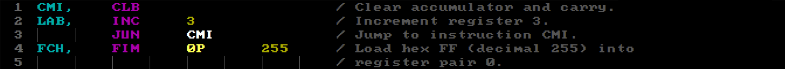
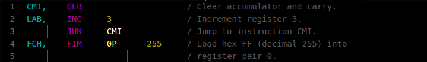
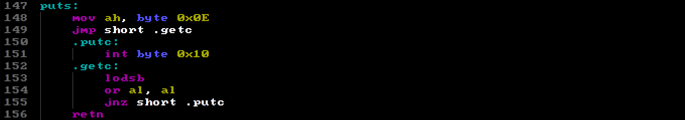
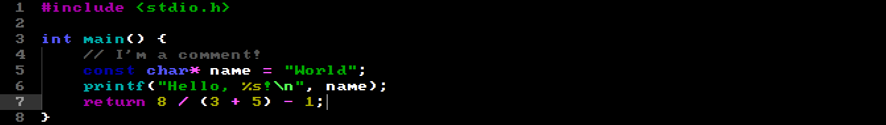
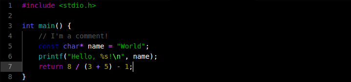
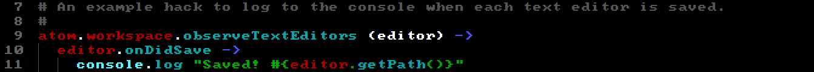
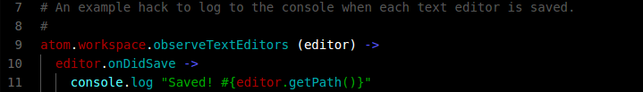

CGA 4 bit syntax theme
======================

A syntax theme using the 16 CGA colors.  
Use with [IBM PC BIOS](http://google.com) font for ultimate nostalgia.

Colors
======
 `#000000`
 `#555555`  
 `#0000AA`
 `#5555FF`  
 `#00AA00`
 `#55FF55`  
 `#00AAAA`
 `#55FFFF`  
 `#AA0000`
 `#FF5555`  
 `#AA00AA`
 `#FF55FF`  
 `#AAAA00`
 `#FFFF55`  
 `#AAAAAA`
 `#FFFFFF`  

Background & Comments  

Types & Type modifiers  

Strings & Characters  

Functions & Classes  

Variables  

Keywords & Operators  

Constants  

Text & Selection  

Screenshots
===========

i4004 Assembly (bios)  
  
i4004 Assembly (default)  
  
x86 Assembly (bios)  
  
x86 Assembly (default)  
  
C (bios)  
  
C (default)  
  
coffee (bios)  
  
coffee (default)  
  
